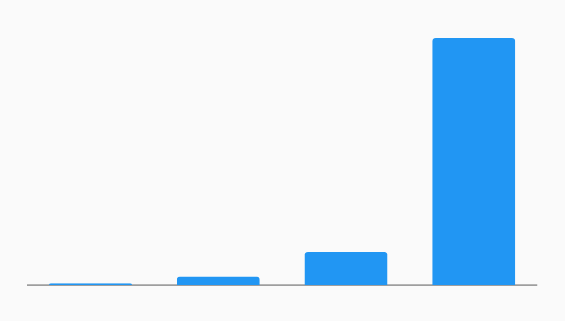

# Hidden Ticks And Labels Axis Axes Example



Example:

```
/// No Axis Example
import 'package:flutter/material.dart';
import 'package:charts_flutter_sa/flutter.dart' as charts;

/// Example of hiding both axis.
class HiddenTicksAndLabelsAxis extends StatelessWidget {
  final List<charts.Series> seriesList;
  final bool animate;

  HiddenTicksAndLabelsAxis(this.seriesList, {this.animate});

  factory HiddenTicksAndLabelsAxis.withSampleData() {
    return new HiddenTicksAndLabelsAxis(
      _createSampleData(),
      // Disable animations for image tests.
      animate: false,
    );
  }


  @override
  Widget build(BuildContext context) {
    return new charts.BarChart(
      seriesList,
      animate: animate,

      /// Assign a custom style for the measure axis.
      ///
      /// The NoneRenderSpec can still draw an axis line with
      /// showAxisLine=true.
      primaryMeasureAxis:
          new charts.NumericAxisSpec(renderSpec: new charts.NoneRenderSpec()),

      /// This is an OrdinalAxisSpec to match up with BarChart's default
      /// ordinal domain axis (use NumericAxisSpec or DateTimeAxisSpec for
      /// other charts).
      domainAxis: new charts.OrdinalAxisSpec(
          // Make sure that we draw the domain axis line.
          showAxisLine: true,
          // But don't draw anything else.
          renderSpec: new charts.NoneRenderSpec()),
    );
  }

  /// Create series list with single series
  static List<charts.Series<OrdinalSales, String>> _createSampleData() {
    final globalSalesData = [
      new OrdinalSales('2014', 5000),
      new OrdinalSales('2015', 25000),
      new OrdinalSales('2016', 100000),
      new OrdinalSales('2017', 750000),
    ];

    return [
      new charts.Series<OrdinalSales, String>(
        id: 'Global Revenue',
        domainFn: (OrdinalSales sales, _) => sales.year,
        measureFn: (OrdinalSales sales, _) => sales.sales,
        data: globalSalesData,
      ),
    ];
  }
}

/// Sample ordinal data type.
class OrdinalSales {
  final String year;
  final int sales;

  OrdinalSales(this.year, this.sales);
}
```
