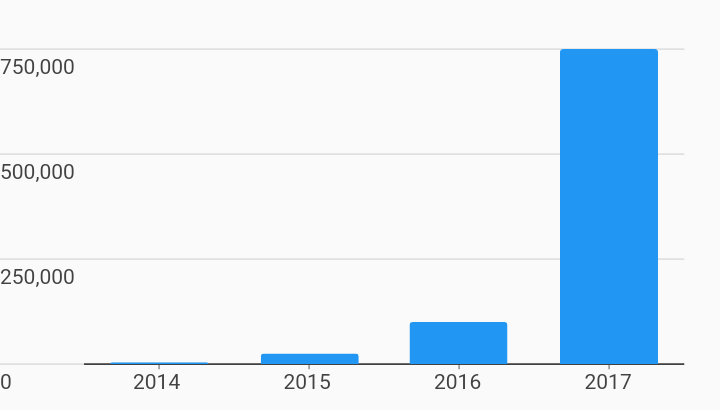

# Measure Axis Label Alignment Axes Example



Example:

```
/// Custom Tick Label Alignment Example
import 'package:flutter/material.dart';
import 'package:charts_flutter_sa/flutter.dart' as charts;

/// Example of using a custom primary measure replacing the renderSpec with one
/// that aligns the text under the tick and left justifies.
class MeasureAxisLabelAlignment extends StatelessWidget {
  final List<charts.Series> seriesList;
  final bool animate;

  MeasureAxisLabelAlignment(this.seriesList, {this.animate});

  factory MeasureAxisLabelAlignment.withSampleData() {
    return new MeasureAxisLabelAlignment(
      _createSampleData(),
      // Disable animations for image tests.
      animate: false,
    );
  }


  @override
  Widget build(BuildContext context) {
    return new charts.BarChart(
      seriesList,
      animate: animate,

      /// Customize the primary measure axis using a small tick renderer.
      /// Use String instead of num for ordinal domain axis
      /// (typically bar charts).
      primaryMeasureAxis: new charts.NumericAxisSpec(
          renderSpec: new charts.GridlineRendererSpec(
        // Display the measure axis labels below the gridline.
        //
        // 'Before' & 'after' follow the axis value direction.
        // Vertical axes draw 'before' below & 'after' above the tick.
        // Horizontal axes draw 'before' left & 'after' right the tick.
        labelAnchor: charts.TickLabelAnchor.before,

        // Left justify the text in the axis.
        //
        // Note: outside means that the secondary measure axis would right
        // justify.
        labelJustification: charts.TickLabelJustification.outside,
      )),
    );
  }

  /// Create series list with single series
  static List<charts.Series<OrdinalSales, String>> _createSampleData() {
    final globalSalesData = [
      new OrdinalSales('2014', 5000),
      new OrdinalSales('2015', 25000),
      new OrdinalSales('2016', 100000),
      new OrdinalSales('2017', 750000),
    ];

    return [
      new charts.Series<OrdinalSales, String>(
        id: 'Global Revenue',
        domainFn: (OrdinalSales sales, _) => sales.year,
        measureFn: (OrdinalSales sales, _) => sales.sales,
        data: globalSalesData,
      ),
    ];
  }
}

/// Sample ordinal data type.
class OrdinalSales {
  final String year;
  final int sales;

  OrdinalSales(this.year, this.sales);
}
```
